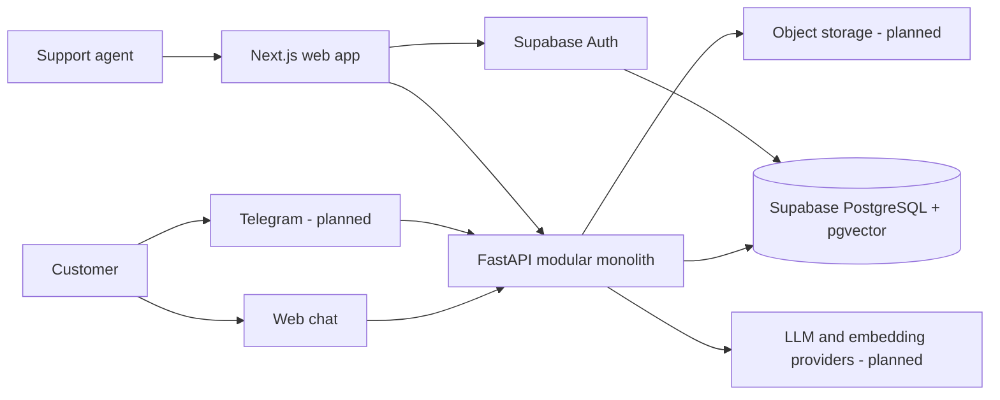

# Architecture

## Status

This document describes the M1 authentication and tenancy architecture plus the intended direction
for later milestones. Sections marked **planned** are not implemented yet.

## Architectural drivers

- Strong tenant isolation and auditable access
- Grounded AI answers with stable source citations
- Replaceable external providers without lowest-common-denominator domain design
- Reproducible local development and deployment
- Operational visibility into latency, quality, cost, and failure
- A small system that can evolve without premature distributed-systems overhead

## System context



M1 adds Supabase Auth sessions, authenticated application routes, FastAPI JWT verification,
organizations, memberships, role authorization, and PostgreSQL RLS. Knowledge, chat, Telegram,
storage, and model providers remain planned.

## Repository and deployment units

The repository contains two application boundaries:

- **Web (`apps/web`)** — Next.js App Router application. It owns browser rendering, Supabase Auth
  session integration, user interaction, and calls to the public API. It accesses Supabase directly
  only for authentication and does not query product data through Supabase Data APIs.
- **API (`apps/api`)** — FastAPI modular monolith. It owns authorization, tenant-aware domain
  workflows, product persistence, and later retrieval, provider orchestration, and channel adapters.

Supabase PostgreSQL with pgvector is the system of record. Supabase Auth owns credentials and
sessions; current application roles and memberships remain PostgreSQL data. Object storage and
external providers will be added behind interfaces when their milestones begin.

A background worker may later run from the same backend codebase for ingestion and retries. That is a process boundary for operational work, not permission to duplicate domain logic or introduce a separate service prematurely.

## Backend module direction

Product modules are organized by capability rather than technical layer alone. M1 implements the
`tenants` capability; later directories remain planned:

```text
app/
├── api/             # HTTP composition, dependencies, and versioned routers
├── core/            # Configuration, observability, security primitives
├── tenants/         # Organizations, memberships, tenant context (M1)
├── knowledge/       # Documents, ingestion, chunks, embeddings (planned)
├── conversations/   # Conversations, messages, feedback, handoff (planned)
├── answering/       # Retrieval, prompting, citations, provider ports (planned)
└── integrations/    # Telegram and other external adapters (planned)
```

Each capability may contain its domain models, application services, persistence adapters, and tests. HTTP handlers should validate/translate requests and delegate behavior; provider SDKs and SQL must not become the domain interface.

## Frontend module direction

Keep route-specific UI close to App Router routes. Promote code into `src/components`, `src/features`, or `src/lib` only when reuse or an explicit boundary appears. API client modules should expose typed application-oriented operations, centralize error handling, and avoid leaking transport details through components.

Prefer server components for data loading and static rendering. Client components are appropriate for interactive chat, streaming state, and browser-only integrations.

M1 uses `@supabase/ssr` cookie-backed clients. The root Next.js proxy refreshes expiring sessions;
server actions own registration, login, logout, and password recovery; and the protected `/app`
layout establishes identity from locally verified asymmetric JWT claims. Confirmation links terminate
at `/auth/confirm`, exchange their one-time token with Supabase Auth, and allow only an explicit
recovery redirect. Passwords and refresh tokens never pass through FastAPI.

## Authenticated request flow

1. Supabase Auth creates an access/refresh-token session through the Next.js SSR integration. The
   access token is short-lived and the proxy persists provider refresh rotation in secure cookies.
2. Next.js validates identity for protected rendering and forwards the access token as a bearer
   token when calling FastAPI.
3. FastAPI validates the configured JWT algorithm, JWKS signature, issuer, audience, expiry, and
   subject, then constructs an authenticated actor.
4. A path organization UUID selects a workspace but never grants access. FastAPI resolves a current
   membership and enforces the role required by the application service.
5. The database dependency begins a transaction, installs verified claims transaction-locally, and
   assumes the restricted `app_api` role before the first product query.
6. Repositories require organization context and use explicit tenant filters; RLS independently
   evaluates the same user against membership data.
7. Expected failures use the stable API error contract and do not reveal foreign-tenant existence.

Protected rendering and API authorization are separate checks. Next.js redirects unauthenticated
application rendering to `/login`; FastAPI still verifies every bearer token independently and never
trusts a Next.js-only header or session assertion.

Organization roles are deliberately absent from JWT claims so a role change takes effect on the
next database authorization check rather than waiting for token refresh.

The M1 authorization matrix is deliberately small: owners administer organization settings and all
roles; admins update organization settings and add/remove members; members have read access; and
every user may leave an organization. The last-owner database invariant applies regardless of the
calling role. Permissions remain role-based only until a concrete later requirement justifies a
more granular model.

## Core request rules

1. The edge/API authenticates the caller or, in a later milestone, validates a public channel session.
2. A trusted tenant context is resolved from authorization data, never accepted blindly from a request body.
3. Application services receive tenant context explicitly.
4. Persistence queries require tenant scope; PostgreSQL policies add defense in depth.
5. External provider calls receive only the minimum required tenant data.
6. Responses use stable public identifiers and avoid exposing provider or storage internals.

## Provider boundaries (planned)

Define narrow ports around capabilities such as text generation, embeddings, object storage, and messaging delivery. Provider adapters translate SDK requests, failures, usage, and retry metadata. Domain/application code chooses behavior such as fallback and no-answer policy without importing vendor SDK types.

Provider abstraction does not mean every vendor feature must be flattened. Vendor-specific capabilities may be exposed through typed capability checks or configuration where they create product value.

## Reliability and observability direction

- Propagate a request/correlation ID through HTTP, jobs, provider calls, and logs.
- Emit structured logs without secrets or unnecessary customer content.
- Track latency, failure, token/cost, retrieval, citation, and handoff outcomes.
- Make asynchronous work idempotent and persist job state before adding retries.
- Use transactional outbox or equivalent only when a real cross-boundary delivery workflow requires it.
- Provide liveness/readiness semantics appropriate to each deployment target.

## Security boundaries

Authentication, tenant resolution, database access, uploaded files, retrieved content, prompt construction, model output, web rendering, and incoming webhooks are distinct trust boundaries. The design assumes uploaded content and model output are untrusted.

See `SECURITY.md` and `docs/database.md` for repository and data-specific controls.

## Decisions intentionally left open

These choices should be approved when their milestone has concrete requirements:

- Object storage provider and document malware-scanning approach
- Background job implementation and queue infrastructure
- Initial LLM and embedding providers and fallback policy
- Hosting platform, regions, recovery objectives, and production topology
- Licensing and commercial distribution terms

Record hard-to-reverse choices as ADRs in `docs/adr/`.
