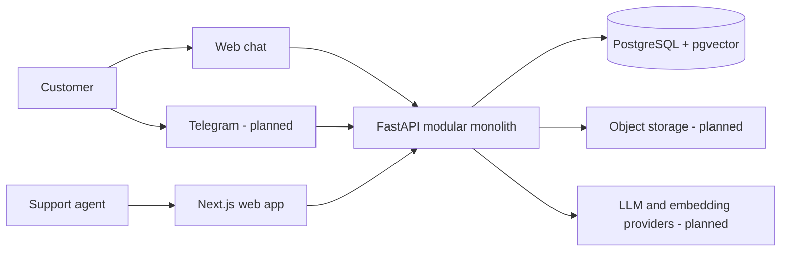

# Architecture

## Status

This document describes the M0 architecture and the intended direction. Sections marked **planned** are not implemented yet.

## Architectural drivers

- Strong tenant isolation and auditable access
- Grounded AI answers with stable source citations
- Replaceable external providers without lowest-common-denominator domain design
- Reproducible local development and deployment
- Operational visibility into latency, quality, cost, and failure
- A small system that can evolve without premature distributed-systems overhead

## System context



Only the web application, API health endpoint, and local database service are scaffolded in M0.

## Repository and deployment units

The repository contains two application boundaries:

- **Web (`apps/web`)** — Next.js App Router application. It owns browser rendering, user interaction, and calls to the public API. Secrets and privileged database access must remain server-side.
- **API (`apps/api`)** — FastAPI modular monolith. It will own authorization, tenant-aware domain workflows, persistence, retrieval, provider orchestration, and channel adapters.

PostgreSQL with pgvector is the initial system of record. Object storage and external providers will be added behind interfaces when their milestones begin.

A background worker may later run from the same backend codebase for ingestion and retries. That is a process boundary for operational work, not permission to duplicate domain logic or introduce a separate service prematurely.

## Backend module direction

When product modules arrive, organize them by capability rather than technical layer alone:

```text
app/
├── api/             # HTTP composition, dependencies, and versioned routers
├── core/            # Configuration, observability, security primitives
├── tenants/         # Organizations, memberships, tenant context
├── knowledge/       # Documents, ingestion, chunks, embeddings
├── conversations/   # Conversations, messages, feedback, handoff
├── answering/       # Retrieval, prompting, citations, provider ports
└── integrations/    # Telegram and other external adapters
```

Each capability may contain its domain models, application services, persistence adapters, and tests. HTTP handlers should validate/translate requests and delegate behavior; provider SDKs and SQL must not become the domain interface.

## Frontend module direction

Keep route-specific UI close to App Router routes. Promote code into `src/components`, `src/features`, or `src/lib` only when reuse or an explicit boundary appears. API client modules should expose typed application-oriented operations, centralize error handling, and avoid leaking transport details through components.

Prefer server components for data loading and static rendering. Client components are appropriate for interactive chat, streaming state, and browser-only integrations.

## Core request rules (planned)

1. The edge/API authenticates the caller or validates a public channel session.
2. A trusted tenant context is resolved from authorization data, never accepted blindly from a request body.
3. Application services receive tenant context explicitly.
4. Persistence queries require tenant scope; PostgreSQL policies may add defense in depth.
5. External provider calls receive only the minimum required tenant data.
6. Responses use stable public identifiers and avoid exposing provider or storage internals.

## Provider boundaries (planned)

Define narrow ports around capabilities such as text generation, embeddings, object storage, and messaging delivery. Provider adapters translate SDK requests, failures, usage, and retry metadata. Domain/application code chooses behavior such as fallback and no-answer policy without importing vendor SDK types.

Provider abstraction does not mean every vendor feature must be flattened. Vendor-specific capabilities may be exposed through typed capability checks or configuration where they create product value.

## Reliability and observability direction

- Propagate a request/correlation ID through HTTP, jobs, provider calls, and logs.
- Emit structured logs without secrets or unnecessary customer content.
- Track latency, failure, token/cost, retrieval, citation, and handoff outcomes.
- Make asynchronous work idempotent and persist job state before adding retries.
- Use transactional outbox or equivalent only when a real cross-boundary delivery workflow requires it.
- Provide liveness/readiness semantics appropriate to each deployment target.

## Security boundaries

Authentication, tenant resolution, database access, uploaded files, retrieved content, prompt construction, model output, web rendering, and incoming webhooks are distinct trust boundaries. The design assumes uploaded content and model output are untrusted.

See `SECURITY.md` and `docs/database.md` for repository and data-specific controls.

## Decisions intentionally left open

These choices should be approved when their milestone has concrete requirements:

- Authentication/Supabase Auth versus another identity provider
- Application-enforced tenancy plus PostgreSQL RLS details
- Object storage provider and document malware-scanning approach
- Background job implementation and queue infrastructure
- Initial LLM and embedding providers and fallback policy
- Hosting platform, regions, recovery objectives, and production topology
- Licensing and commercial distribution terms

Record hard-to-reverse choices as ADRs in `docs/adr/`.
